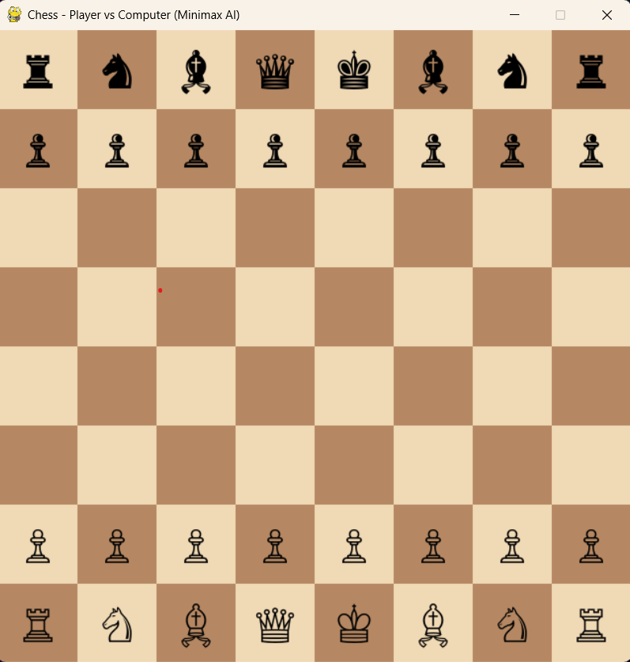
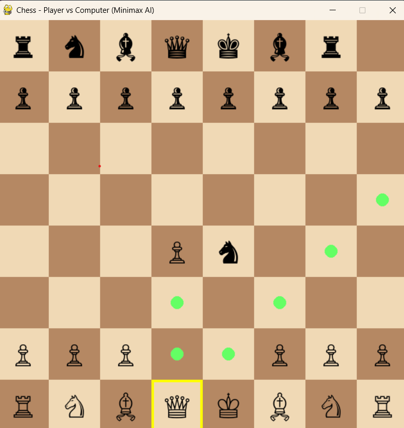

Chess AI – Player vs Computer (Minimax + Alpha-Beta)

This is a GUI-based **Chess game** where you play as **White**, and the computer (AI) plays as **Black**. The AI uses the **Minimax algorithm with Alpha-Beta Pruning** to make intelligent decisions.

## Built using:

- `pygame` for graphical interface
- `python-chess` for chess engine logic
- `minimax` for decision-making

---

## How to Run the Game

## Prerequisites

Make sure that  **Python 3** and the required libraries installed.
they are :
pygame
📌 Used to create the graphical interface (window, buttons, fonts, events, etc.)
python-chess
📌 Provides the logic for chess rules, legal moves, board state, checkmate, promotion, etc.


### 📦 Required Libraries

```bash
pip install pygame python-chess


Run Command
In your VS Code terminal or command line:

bash

python Chess.py


```

### Algorithm Used

 Minimax with Alpha-Beta Pruning
Minimax is a recursive decision-making algorithm for two-player games.

Alpha-Beta Pruning optimizes the search tree by cutting off branches that won't affect the outcome.

The AI uses a simple material-based evaluation function (Pawn = 1, Knight/Bishop = 3, Rook = 5, Queen = 9).

This makes the AI fast and responsive even with just depth 2.


### How to Play
You play as White and move first.

Click on a piece to select it, and click on the destination square to move.

Legal moves are highlighted with dots.

The AI (Black) plays automatically after your turn.

Game ends with:

Checkmate

Stalemate

Insufficient material

Repetition or 75-move rule

Pawn promotion is automatically handled by the AI (to Queen by default).


### Screenshot :





For valid chess moves :


