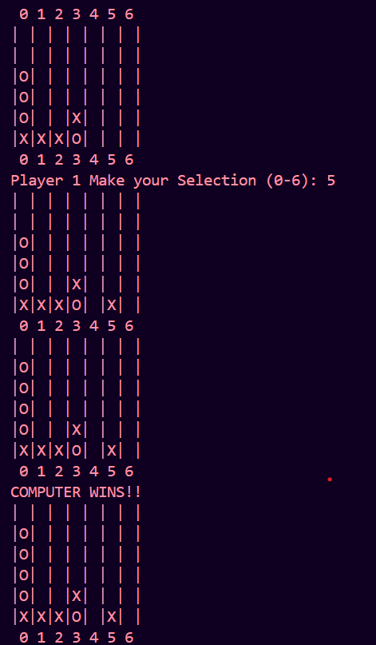

# Connect Four AI – Player vs Computer (Minimax + Alpha-Beta Pruning)

This is a terminal-based **Connect Four game** where you play against an AI. The computer uses the **Minimax algorithm with Alpha-Beta pruning** to make strategic decisions and block you or win efficiently.

---

## How to Run the Game

### Prerequisites

- Python 3.x installed
- No external libraries needed — only built-in modules (`random`, `math`)

### Run Command

```bash
python Connect_Four.py


If you're using VS Code terminal, open the folder and run:

bash

python Connect_Four.py

```

# How to Play
The board is 6 rows by 7 columns

You are X, the computer is O

On your turn, enter a column number (0 to 6) to drop your piece

The first player to connect four pieces in a row (vertically, horizontally, or diagonally) wins

If the board fills up without a winner, the game is a draw

# Algorithm Used
# Minimax Algorithm with Alpha-Beta Pruning
AI searches moves up to depth 4

Evaluates positions using a scoring system:

4 in a row → +100 (win)

3 in a row → +10 (strong)

Center control → bonus

Blocks opponent's win → critical

Uses alpha-beta pruning to eliminate unnecessary branches and speed up the decision-making process

# Screenshot

Place a screenshot of a game session in:


For All correct moves :





