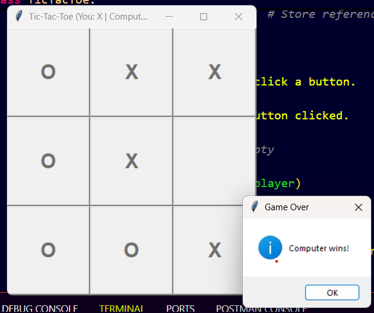
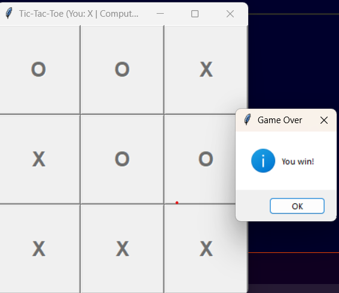
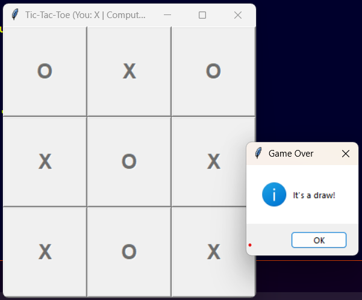

Tic Tac Toe AI (Minimax)

A Python-based GUI Tic Tac Toe game where you play as "X" and the computer plays as "O". The computer uses the **Minimax algorithm** to make intelligent, unbeatable moves.

---

How to Run the Game

Prerequisites

- Python 3.x installed on your system
- No external libraries needed — uses Python's built-in:

- `tkinter` for GUI
- `math` for score calculations

Run Command

Open terminal and run:

```bash

python tic_tac_toe.py


If using Windows:
python tic_tac_toe.py


How to Play
You are Player X, the computer is Player O

Click on any empty square to place your move

After your turn, the AI will respond instantly

The game continues until:

You win

Computer wins

The game is a draw (board is full)

The GUI updates in real-time, and a popup message shows the result.


 Algorithm Used

 Minimax Algorithm
This is a backtracking algorithm that tries all possible moves recursively and assigns scores based on the outcome:

+1: Computer (O) wins

-1: Player (X) wins

0: Draw

At each turn, the AI selects the move that maximizes its chance of winning and minimizes the player’s chance.

It guarantees the best possible move at every turn.

```

Screenshots

For the computer win :



For the user win :




For draw:



Python 3.x

Tkinter GUI toolkit

Algorithm: Minimax
