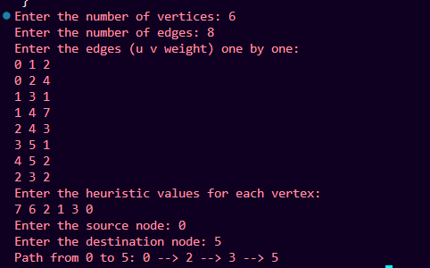
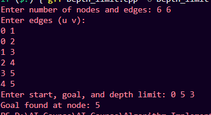

 Greedy Best-First Search (GBFS)
✅ How the Algorithm Works:
Greedy Best-First Search (GBFS) is an informed search algorithm that uses a heuristic function h(n) to always choose the path that appears to be closest to the goal.

Core Mechanism:
Select the node with the lowest heuristic value.

It does not consider actual path cost, only the estimated cost to the goal (greedy).

May not guarantee the shortest path.

🎯 Applications:
Web crawlers and information retrieval

AI pathfinding in games

Solving mazes and puzzles

Planning & robotics where fast response is preferred over optimal paths

⏱️ Time and Space Complexity:
Time Complexity:
Worst case: O(b^m)
Where:

b = branching factor

m = maximum depth of search

Space Complexity:
O(b^m) due to storing all frontier nodes (open list)

🧪 Sample Input & Output

The graph:

