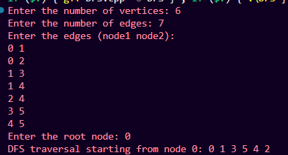
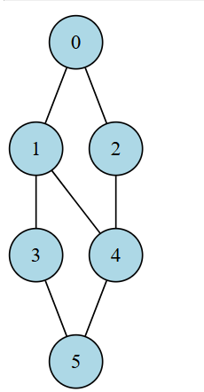

 Depth-First Search (DFS)
✅ How the Algorithm Works
Depth-First Search (DFS) explores as far as possible along a branch before backtracking.

Steps:
Start from the root node.

Mark it as visited and print it.

Recursively visit all unvisited neighbors.

Backtrack when no unvisited neighbors remain.

🧠 Applications
Detecting cycles in graphs

Connected component detection

Topological sorting

Solving puzzles (e.g., mazes, Sudoku)

Pathfinding algorithms (as a base)

⏱️ Time and Space Complexity
Time Complexity:
O(V²) (because of the adjacency matrix)

Space Complexity:
O(V) for the visited array and recursive call stack

🧪 Sample Input & Output

The graph:

