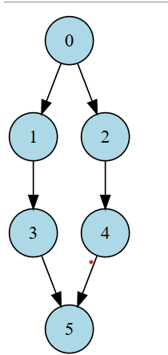

Depth-Limited Search (DLS)
How the Algorithm Works
Depth-Limited Search is a variant of Depth-First Search (DFS) that explores paths only up to a specified depth limit.

Key Steps:
Start from the start node.

Recurse into neighbors while tracking current depth.

Stop when depth limit is 0.

Backtrack when necessary.

Applications
Used in Iterative Deepening DFS (IDDFS)

When goal depth is known or limited

Solving puzzles with restricted moves

Decision trees with bounded levels

Time and Space Complexity
Time Complexity:
O(b^l) where:

b = branching factor

l = depth limit

Space Complexity:
O(l) due to recursion stack (same as DFS)

🧪 Sample Input & Output

The graph:

