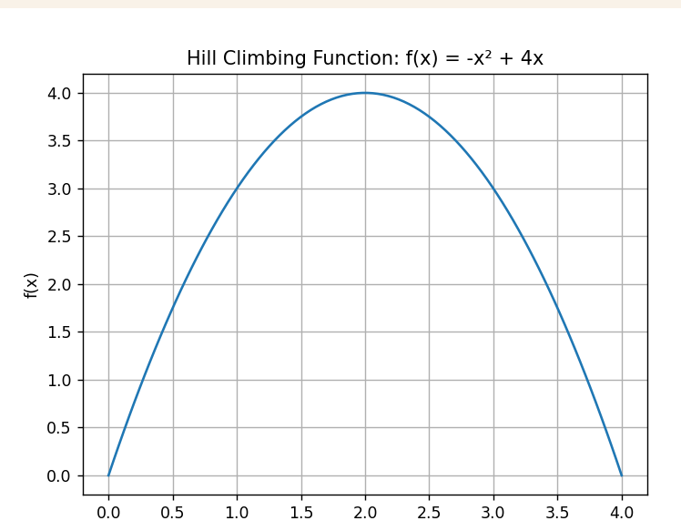

How the Algorithm Works:
Hill Climbing is a local search algorithm used for optimization problems. It tries to iteratively improve the solution by moving towards a neighbor with a higher value.

Your code maximizes the function:

f(x) = -x² + 4x

This is a downward-opening parabola with a maximum at x = 2.

🧮 Steps:
Start from an initial guess x = start.

Evaluate both neighbors: x + step_size and x - step_size.

If a neighbor has a higher value, move to that neighbor.

Repeat up to max_iter times or stop early if no better neighbor exists.

📌 Applications of Hill Climbing
Function optimization (like in this case)

Feature selection in machine learning

Game AI (e.g., pathfinding or state-space search)

Constraint satisfaction problems

Robotics motion planning

⏱️ Time and Space Complexity
Time Complexity:
O(max_iter) – each iteration evaluates up to 2 neighbors.

Space Complexity:
O(1) – constant memory usage (no data structures beyond scalars).

🧪 Sample Input & Output

The graph:

