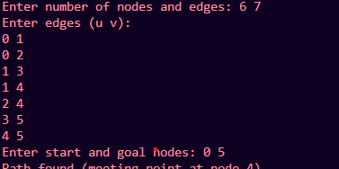

Bidirectional Breadth-First Search (Bi-BFS)
 How the Algorithm Works
Bidirectional BFS improves the efficiency of normal BFS by simultaneously searching from:

the start node forward, and

the goal node backward.

Both searches proceed level by level, and terminate when their frontiers meet.

Key Concepts:
Two queues (q_f and q_b) and two visited sets (visited_f and visited_b) are used.

If any node is found in both visited sets → path exists.

Reduces time complexity by meeting in the middle.

 Applications
Shortest path in large undirected graphs

Social networks (finding degree of separation)

Game map pathfinding when both source and destination are known

Word ladder puzzles, etc.

Time and Space Complexity
Time Complexity:
O(b^(d/2))
Where:

b = branching factor

d = shortest distance between start and goal

Much faster than BFS O(b^d) for large d.

Space Complexity:
O(b^(d/2)) for visited sets and queues

🧪 Sample Input & Output

The graph:

